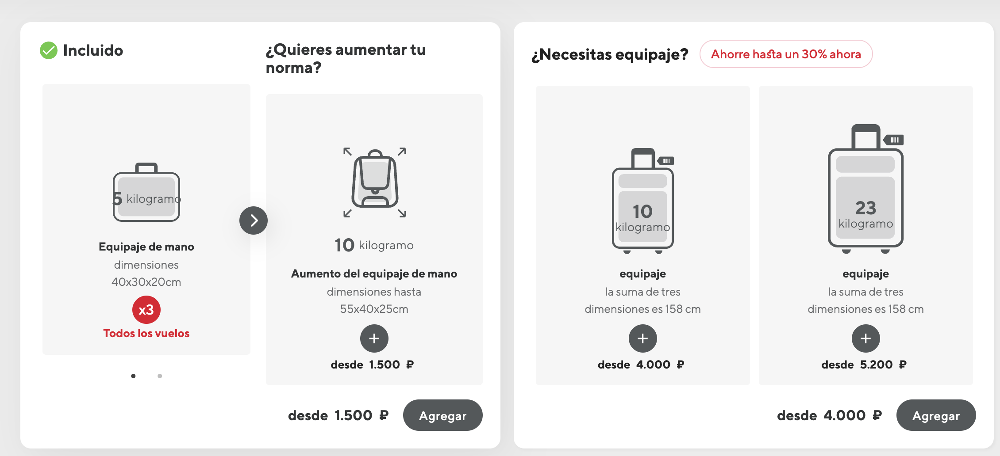

# TravelWithAnastasia

## Travel Itinerary Summary

**Journey:** Copenhagen → Tbilisi → Buenos Aires
**Dates:** October 17 - November 21, 2025
**Travelers:**
- Adults: Miguel Lemos, Anastasia Viazova, Leonid Viazov
- Child: Georgii Viazov (3 years old)
- Infant: Stanislav Viazov (1 year old)
- Pet: Scooby Doo

---

## Flight Details

### 1. October 17-18, 2025: Copenhagen → Tbilisi
**Passenger:** Miguel Lemos + Scooby Doo (pet)

**Flights:**
- **TK 1786:** Copenhagen (CPH) → Istanbul (IST)
  - Oct 17, 19:20 → Oct 17, 23:40
  - Terminal: IST Terminal 2
- **TK 0376:** Istanbul (IST) → Tbilisi (TBS)
  - Oct 18, 02:10 → Oct 18, 05:30

**Airline:** Turkish Airlines
**Class:** Economy (Q)
**Reservation:** S37S3U

**Baggage per passenger:**
- Checked: 1 piece × 23 kg (max 158 cm total dimensions)
- Carry-on: 1 piece × 8 kg (55×40×23 cm)
- Personal item: 1 piece × 4 kg (40×30×15 cm - fits under seat)
- **Total per person: 35 kg** (23 kg checked + 12 kg cabin)

**Miguel's total:** 35 kg
**Pet fee:** DKK 2,665 for Scooby Doo

---

### 2. October 25, 2025: Kazan → Tbilisi
**Passengers:**
- **Adults:** Anastasia Viazova, Leonid Viazov (2)
- **Child:** Georgii Viazov (3 years old)
- **Infant:** Stanislav Viazov (1 year old)

**Flight:** WZ 1501 - Kazan (KZN) → Tbilisi (TBS)
- Oct 25, 09:15 → Oct 25, 13:20

**Airline:** Red Wings
**Class:** Economy (FLTOW)
**Reservation:** B18565959305

**Baggage per passenger:**

**Adults (Anastasia, Leonid):**
- Checked: Not included in fare
- Hand baggage: 1 piece × 5 kg per passenger (40×30×20 cm)
- **Total per adult: 5 kg cabin only**

**Child (Georgii, 3 years):**
- Checked: Not included in fare
- Hand baggage: 1 piece × 5 kg (40×30×20 cm)
- **Total: 5 kg cabin only**

**Infant (Stanislav, 1 year):**
- Checked: Not included in fare
- Hand baggage: 1 piece × 10 kg
- **Total: 10 kg cabin only**

**Group total:** 25 kg cabin (2 adults × 5 kg + 1 child × 5 kg + 1 infant × 10 kg)

---

### 3. October 25, 2025: Tbilisi → Kazan (Return)
**Passenger:** Leonid (solo return)

**Flight:** WZ 1502 - Tbilisi (TBS) → Kazan (KZN)
- Oct 25, 14:25 → Oct 25, 16:20

**Airline:** Red Wings
**Class:** Economy (FLTOW)

**Baggage per passenger:**
- Checked: Not included in fare
- Hand baggage: 1 piece × 5 kg (40×30×20 cm)
- **Total: 5 kg cabin only**

---

### 4. November 20, 2025: Tbilisi → Istanbul
**Passengers:**
- **Adults:** Miguel Lemos, Anastasia Viazova (2)
- **Child:** Georgii Viazov (3 years old)
- **Infant:** Stanislav Viazov (1 year old)

**Flight:** Turkish Airlines - Tbilisi (TBS) → Istanbul (IST)
**Reservation:** WGZEHM

**Baggage allowance (confirmed with Turkish Airlines):**

**Adults (Miguel, Anastasia):**
- Checked: 1 piece × 23 kg (max 158 cm)
- Carry-on: 1 piece × 8 kg (55×40×23 cm)
- Personal item: 1 piece × 4 kg (40×30×15 cm - under seat)
- **Total per adult: 35 kg** (23 kg checked + 12 kg cabin)

**Child (Georgii, 3 years):**
- Same as adult: 1 piece × 23 kg checked + 12 kg cabin
- **Total: 35 kg**

**Infant (Stanislav, 1 year):**
- Checked: Typically 1 piece × 10 kg (or per airline policy)
- Carry-on: 1 piece × 8 kg
- Stroller: Allowed (can be gate-checked)
- **Total: 10 kg checked + 8 kg cabin + stroller**

**Group total (per Turkish Airlines rep): 70 kg for adults**
**Note:** The representative confirmed 70 kg total for the 2 adults (2 × 35 kg). Child and infant allowances apply additionally.

---

### 5. November 21, 2025: Istanbul → Buenos Aires
**Passengers:**
- **Adults:** Miguel Lemos, Anastasia Viazova (2)
- **Child:** Georgii Viazov (3 years old)
- **Infant:** Stanislav Viazov (1 year old)

**Flight:** Turkish Airlines - Istanbul (IST) → Buenos Aires (EZE)
**Reservation:** TF3BSV
**Fare type:** Basic Economy

**Baggage allowance (confirmed with Turkish Airlines):**

**Adults (Miguel, Anastasia):**
- Checked: Not included in basic economy fare
- Carry-on: 1 piece × 8 kg (55×40×23 cm)
- Personal item: 1 piece × 4 kg (40×30×15 cm - under seat)
- **Total per adult: 12 kg cabin only**

**Children (Georgii, Stanislav):**
- Checked: Not included
- Carry-on: 1 piece × 10 kg cabin each
- **Total per child/infant: 10 kg cabin only**

**Group total (per Turkish Airlines rep): 44 kg cabin**
- 2 adults × 12 kg = 24 kg
- 2 children × 10 kg = 20 kg
- **Total: 44 kg cabin** (no checked baggage)

**Note:** Basic economy fare. Checked baggage can be purchased separately if needed.

---

## Baggage Capacity Overview

### Per-Segment Breakdown

Here's what the family can bring on each flight segment:

| Segment | Passengers | Checked Baggage | Cabin Baggage | Total Capacity |
|---------|-----------|-----------------|---------------|----------------|
| **CPH→IST→TBS** Oct 17-18 | Miguel (1 adult) | 23 kg | 12 kg | **35 kg** |
| **KZN→TBS** Oct 25 | Anastasia, Leonid (adults) Georgii (child), Stanislav (infant) | 0 kg (not included) | 25 kg (2×5kg + 1×5kg + 1×10kg) | **25 kg** |
| **TBS→KZN** Oct 25 | Leonid (1 adult) | 0 kg (not included) | 5 kg | **5 kg** |
| **TBS→IST** Nov 20 | Miguel, Anastasia (adults) Georgii (child), Stanislav (infant) | **70 kg adults** (confirmed by TK) + child/infant allowance | 24 kg adults + child/infant cabin | **~94-104 kg** (pending full details) |
| **IST→EZE** Nov 21 | Miguel, Anastasia (adults) Georgii (child), Stanislav (infant) | 0 kg (not included) | **44 kg total** (2×12kg + 2×10kg) (confirmed by TK) | **44 kg** |

---

## End-to-End Baggage Summary

### What You Can Actually Bring

When considering the complete journey from start to finish, here's your realistic baggage capacity:

**The limiting factor is the Istanbul → Buenos Aires segment:**
- Only **44 kg total** in cabin baggage (confirmed by Turkish Airlines):
  - 2 adults × 12 kg = 24 kg
  - 2 children × 10 kg = 20 kg
- No checked baggage included

**Practical options:**

1. **Travel light (cabin only):**
   - Pack 44 kg total in cabin bags:
     - Adults (Miguel, Anastasia): 12 kg each = 24 kg
     - Children (Georgii, Stanislav): 10 kg each = 20 kg
   - No additional fees
   - Simplest approach

2. **Purchase checked baggage for IST→EZE:**
   - Contact Turkish Airlines to add checked baggage to the basic economy ticket
   - Would allow you to bring more items
   - Additional cost applies

### Helpful Context

**Red Wings flights (KZN→TBS, TBS→KZN):**
- Most restrictive cabin size: 40×30×20 cm
- Weight: 5 kg per adult, 10 kg for infant
- Typical bags: Small backpack, soft duffel, compression bag
- Won't fit: Standard rolling carry-on, hardshell suitcase

**Turkish Airlines flights:**
- More generous cabin size: 55×40×23 cm (carry-on) + 40×30×15 cm (personal)
- Weight: 12 kg total per adult (8 kg + 4 kg)
- Fits: Standard rolling carry-on + laptop bag/purse

### Packing Strategy

For the Red Wings segments, you'll need smaller, softer bags. For Turkish Airlines, you can use standard carry-on luggage.

**Tip:** Use compression bags to maximize space within the size restrictions. On Red Wings flights, wear heavier clothing to save weight in your bag.

---

## Baggage Optimization Strategy

### Turkish Airlines Call Confirmation (October 8, 2025)

After calling Turkish Airlines customer service, we received confirmed baggage allowances that differ from the initial documentation:

**Flight 4 (TBS→IST) - Confirmed:**
- Adults (Miguel, Anastasia): **70 kg total** (2 × 35 kg each)
- Child and infant allowances apply additionally

**Flight 5 (IST→EZE) - Confirmed:**
- **Total cabin: 44 kg** (not 48 kg as initially documented)
- Breakdown: 2 adults × 12 kg + 2 children × 10 kg = 44 kg
- No checked baggage included (Basic Economy)

### Red Wings Upgrade Recommendation

**Passenger Clarification:**
- **Kazan→Tbilisi:** 4 passengers (Leonid, Anastasia, Georgii, Stanislav)
- **Leonid's situation:** Stays in Tbilisi, returns to Kazan one week later. His bag continues with the family to Buenos Aires.
- **Turkish Airlines flights:** 4 passengers (Miguel, Anastasia, Georgii, Stanislav) + Leonid's bag

**Current Red Wings allowance (4 passengers from Kazan):**
- Leonid: 5 kg cabin
- Anastasia: 5 kg cabin
- Georgii: 5 kg cabin
- Stanislav: 10 kg cabin
- **Total: 25 kg cabin**

**Istanbul→Buenos Aires constraint:**
- **Total cabin limit: 44 kg** for all 4 passengers
- Bags from Kazan + Miguel's bags must fit within 44 kg

**Optimal Solution: Upgrade hand baggage on Red Wings**

Select **"Aumento del equipaje de mano"** (10 kg upgrade) for:
- ✅ Anastasia (upgrade from 5 kg to 10 kg)
- ✅ Georgii (upgrade from 5 kg to 10 kg)

**Result:**
- Bags from Kazan: **35 kg** (Leonid 5 kg + Anastasia 10 kg + Georgii 10 kg + Stanislav 10 kg)
- Miguel's cabin allowance: **9 kg** (44 - 35 = 9 kg remaining)
- Cost: ~3,000 ₽ (1,500 ₽ per passenger)
- Same physical bags throughout (all 40×30×20 cm)

**Alternative (if Miguel brings minimal cabin):**
Upgrade all three adults (Leonid, Anastasia, Georgii) to 10 kg:
- Bags from Kazan: **40 kg** (10+10+10+10)
- Miguel's cabin allowance: **4 kg** (44 - 40 = 4 kg remaining)
- Cost: ~4,500 ₽
- Maximizes capacity from Kazan, but Miguel must travel very light in cabin

**Why not checked baggage?**
Checked baggage on Red Wings cannot be carried as cabin on Turkish Airlines flights. The upgrade option ensures consistent cabin bags throughout.

### Important: Bag Size Restrictions

**Note:** 4 passengers travel Kazan→Tbilisi (Leonid, Anastasia, Georgii, Stanislav). Leonid stays in Tbilisi for one week, but his bag continues with the family to Buenos Aires.

**Critical correction:** The Red Wings 10 kg upgrade ALSO increases size limits!

**Red Wings basic (5 kg):**
- Maximum: 40×30×20 cm

**Red Wings WITH 10 kg upgrade:**
- Maximum: **55×40×25 cm** ✅
- This matches standard cabin roller size!

**Turkish Airlines:**
- Carry-on: 55×40×23 cm
- Personal item: 40×30×15 cm

**With the 10 kg upgrade, size restrictions align:**

✅ **Will work (with 10 kg upgrade):**
- **Standard cabin-sized rollers** up to 55×40×25 cm
- **Backpacks** within dimensions
- **Soft duffel bags**

❌ **Will NOT work:**
- **58 cm suitcase** (like the ABS plastic suitcase mentioned) - exceeds 55 cm limit by 3 cm
- Large roller suitcases (70-80 cm height)

**Important:** The 58 cm ABS plastic suitcase (55L) that Anastasia wants to bring is **too large** for Red Wings even with the upgrade. Maximum is 55 cm on longest dimension.

---

## Pet Travel: Scooby Doo's Journey

### Can Scooby Doo travel from Copenhagen to Buenos Aires?

**Answer: Scooby Doo can travel from Copenhagen to Tbilisi, but documentation for subsequent segments (Tbilisi → Istanbul → Buenos Aires) is not available in the tickets.**

### Verified Pet Travel Information

#### Copenhagen → Tbilisi (Confirmed ✓)

**Source:** `Scooby Doo - Copenhagen Tblisi.png`

**Evidence:**
The fare breakdown clearly shows:
- **"Pet carriage fee"**: DKK 2,665
- **"Pet transportation fee"**: DKK 2,665

This is included in Miguel's booking for the Turkish Airlines flights CPH→IST→TBS.

**Turkish Airlines Pet Policy** (from Miguel's e-ticket):
The ticket doesn't specify whether Scooby Doo travels in-cabin or cargo, but Turkish Airlines allows pets on their flights with proper fees paid.

---

#### Tbilisi → Istanbul (Confirmed ✓)

**Source:** `Tblisi - Istambul.pdf`

**Evidence:**
The booking document shows a "🐾 Traveling with a pet" section at the bottom of page 1 with complete pet details:

**Tbilisi (TBS) - Istanbul (IST)**
- **Passenger name:** MR. MIGUEL LEMOS
- **Type and breed:** DOG / BLACK AND TAN TERRIER
- **Pet dimensions:** 15 kg - 46×35×24 cm
- **Pet fee:** TRY 16,916

Scooby Doo is confirmed on this flight segment.

---

#### Istanbul → Buenos Aires (Confirmed ✓)

**Source:** `Istambul - Buenos Aires.pdf`

**Evidence:**
The booking document shows a "🐾 Traveling with a pet" section at the bottom of page 1 with complete pet details:

**Istanbul (IST) - Buenos Aires (EZE)**
- **Passenger name:** MR. MIGUEL LEMOS
- **Type and breed:** DOG / BLACK AND TAN TERRIER
- **Pet dimensions:** 15 kg - 45×30×25 cm
- **Pet fee:** TRY 34,727.00

Scooby Doo is confirmed on this flight segment.

**Note:** Argentina has specific pet import requirements (health certificates, vaccinations, etc.). Ensure all documentation is prepared before travel.

---

### Pet Travel Summary

**Scooby Doo can travel the complete route from Copenhagen to Buenos Aires! ✅**

All three Turkish Airlines flight segments have confirmed pet bookings:

1. ✅ **CPH→IST→TBS** (Oct 17-18): DKK 2,665
2. ✅ **TBS→IST** (Nov 20): TRY 16,916
3. ✅ **IST→EZE** (Nov 21): TRY 34,727.00

**Pet Details:**
- **Type and breed:** Dog / Black and Tan Terrier
- **Weight:** 15 kg
- **Carrier dimensions:** Approximately 45-46 × 30-35 × 24-25 cm
- **Total pet fees:** DKK 2,665 + TRY 51,643.00

**Important Reminders:**
- Ensure all pet documentation is prepared (health certificates, vaccinations)
- Argentina has specific pet import requirements - verify compliance before travel
- Confirm pet carrier meets airline specifications
- Bring copies of all pet booking confirmations and payment receipts

---

## Call Reference Information

### For Turkish Airlines Support Call

Use this information when calling Turkish Airlines about baggage allowances, pet travel, or booking modifications:

#### Flight 1: Copenhagen → Tbilisi (via Istanbul)
- **Reservation Code (PNR):** S37S3U
- **Ticket Number:** 235-2271903912
- **Passenger:** Miguel Lemos
- **Travel Date:** October 17-18, 2025
- **Flights:**
  - TK 1786: Copenhagen (CPH) → Istanbul (IST), Oct 17, 19:20 - 23:40
  - TK 0376: Istanbul (IST) → Tbilisi (TBS), Oct 18, 02:10 - 05:30
- **Class:** Economy (Q)
- **Pet:** Scooby Doo (Dog / Black and Tan Terrier, 15 kg) - **Confirmed, Fee: DKK 2,665**

---

#### Flight 4: Tbilisi → Istanbul
- **Reservation Code (PNR):** WGZEHM
- **Ticket Numbers:** Not yet issued (booking confirmed)
- **Passengers:**
  - Adults: Miguel Lemos, Anastasiia Viazova
  - Child: Georgii Viazov (3 years)
  - Infant: Stanislav Viazov (1 year)
- **Travel Date:** November 20, 2025
- **Airline:** Turkish Airlines
- **Route:** Tbilisi (TBS) → Istanbul (IST)
- **Baggage (confirmed with Turkish Airlines):**
  - Adults: 70 kg total (2 × 35 kg)
  - Child & Infant: Additional allowance applies
- **Pet:** Scooby Doo (Dog / Black and Tan Terrier, 15 kg, 46×35×24 cm) - **Confirmed, Fee: TRY 16,916**

---

#### Flight 5: Istanbul → Buenos Aires
- **Reservation Code (PNR):** TF3BSV
- **Ticket Numbers:** Not yet issued (booking confirmed)
- **Passengers:**
  - Adults: Miguel Lemos, Anastasiia Viazova
  - Child: Georgii Viazov (3 years)
  - Infant: Stanislav Viazov (1 year)
- **Travel Date:** November 21, 2025
- **Airline:** Turkish Airlines
- **Flight:** Istanbul (IST) → Buenos Aires (EZE)
- **Fare Type:** Basic Economy
- **Baggage (confirmed with Turkish Airlines):**
  - Checked: NOT included (0 kg)
  - Cabin: **44 kg total** (2 adults × 12 kg + 2 children × 10 kg)
- **Pet:** Scooby Doo (Dog / Black and Tan Terrier, 15 kg, 45×30×25 cm) - **Confirmed, Fee: TRY 34,727.00**

---

### For Red Wings Airlines Support Call

#### Flight 2: Kazan → Tbilisi
- **Reservation Code:** B18565959305
- **Ticket Numbers:**
  - Anastasiia Viazova (adult): 309-6126464288
  - Leonid Viazov (adult): 309-6126464287
  - Georgii Viazov (child, 3 years): 309-6126464289
  - Stanislav Viazov (infant, 1 year): 309-6126464290
- **Travel Date:** October 25, 2025
- **Flight:** WZ 1501, Kazan (KZN) → Tbilisi (TBS), 09:15 - 13:20
- **Class:** Economy (FLTOW)
- **Baggage:** Hand baggage only - 5 kg per adult/child, 10 kg for infant (40×30×20 cm)

---

#### Flight 3: Tbilisi → Kazan (Leonid Return)
- **Ticket Number:** 309-6171827315
- **Passenger:** Leonid Viazov
- **Travel Date:** October 25, 2025
- **Flight:** WZ 1502, Tbilisi (TBS) → Kazan (KZN), 14:25 - 16:20
- **Class:** Economy (FLTOW)
- **Baggage:** Hand baggage only - 5 kg (40×30×20 cm)

---

### Quick Reference Summary

**Turkish Airlines Reservations:**
- S37S3U (Miguel, Oct 17-18, CPH→TBS)
- WGZEHM (4 passengers, Nov 20, TBS→IST)
- TF3BSV (4 passengers, Nov 21, IST→EZE)

**Red Wings Reservation:**
- B18565959305 (4 passengers, Oct 25, KZN→TBS)
- Leonid return (Oct 25, TBS→KZN) - Check ticket for reservation code

**Pet Travel (Turkish Airlines only):**
- All three Turkish Airlines flights have Scooby Doo confirmed
- Total pet fees: DKK 2,665 + TRY 51,643.00

---

## Data Verification & Sources

All baggage allowances cited below are taken directly from the official e-tickets and booking documents. Here's the evidence for each claim:

### 1. Copenhagen → Tbilisi (Miguel) - 35 kg per person

**Source:** `Miguel Copenhagen - Tblisi.pdf`

**Evidence:**
- **Checked baggage:** "Free Baggage: The free baggage allowance may vary depending on the origin-destination and the cabin. Maximum dimension of each piece is 158 cm. Upper limit of 1 piece for business baggage is 32 kg and **upper limit of 1 piece for economy baggage is 23 kg.**"

- **Cabin baggage:** "Cabin Baggage: Cabin baggage which is up to **8 kg/per pcs** is carried without any charge. Passengers can bring 2 pieces in business class and **1 piece for economy classes**. Max. dimensions for each piece are 23X40X55 cm in all classes."

- **Personal item:** Turkish Airlines standard policy allows 1 personal item (4 kg, 40×30×15 cm) in addition to carry-on

**Calculation:** 23 kg checked + 8 kg carry-on + 4 kg personal = **35 kg per person**

---

### 2. Kazan → Tbilisi (4 passengers) - 25 kg total cabin

**Source:** `Anastasia Kazan - Tblisi E-Ticket.pdf`, `Georgii Kazan - Tblisi E-Ticket.pdf`, `Leonid Kazan - Tblisi E-Ticket.pdf`, `Stanislav Kazan - Tblisi E-Ticket .pdf`

**Evidence:**

**For adults (Anastasia, Georgii, Leonid):**
- **Checked:** "Baggage: Checked baggage is not included in the fare."
- **Hand baggage:** "Hand baggage: **1 pc 5kg per passenger** 40x30x20 cm."

**For infant (Stanislav):**
- **Checked:** "Baggage: Checked baggage is not included in the fare."
- **Hand baggage:** "Baggage: **1 pc 10kg per passenger**"

**Calculation:** (3 adults × 5 kg) + (1 infant × 10 kg) = 15 + 10 = **25 kg total**

---

### 3. Tbilisi → Kazan (Leonid return) - 5 kg cabin

**Source:** `Leonid Tblisi - Kazan.pdf`

**Evidence:**
- **Checked:** "Багаж/Baggage allow: **NO**"
- **Hand baggage:** Red Wings standard economy fare includes 1 piece hand baggage (confirmed as 5 kg from outbound ticket policy)

**Calculation:** 0 kg checked + 5 kg hand baggage = **5 kg total**

---

### 4. Tbilisi → Istanbul (4 passengers) - ~113-136 kg total

**Source:** `Tblisi - Istambul Baggage Allowed Version 1.png`

**Evidence:**

**For adults (Miguel, Anastasia, Georgii) - each:**
- **Checked:** "Checked baggage: **1 piece per person, 23 kg each**. Dimensions (length + width + height) of each piece cannot exceed 158 cm"

- **Carry-on:** "Carry-on baggage: **1 piece per person, 8 kg each**. Dimensions of each piece cannot exceed 55x40x23 cm"

- **Personal item:** "Personal item: **1 piece per person, 4 kg each**. Dimensions of each piece cannot exceed 40x30x15 cm. Must be placed under the seat in front of you."

**For infant (Stanislav):**
- **Carry-on:** "Carry-on baggage: **1 piece per person, 8 kg each**"
- **Stroller:** "1 stroller per person. Can be brought onto the plane or checked at the airport. If carried on board, 8 kg per stroller."
- **Checked:** Contact airline for infant checked baggage policy (typically 1 piece × 23 kg or 1 piece × 10 kg depending on airline policy)

**Calculation:**
- Adults: (3 × 23 kg checked) + (3 × 12 kg cabin) = 69 + 36 = 105 kg
- Infant: (0-23 kg checked estimated) + 8 kg cabin = 8-31 kg
- **Total: ~113-136 kg** (depending on infant checked baggage policy)

---

### 5. Istanbul → Buenos Aires (4 passengers) - 48 kg cabin only

**Source:** `Istambul - Buenos Aires Baggage Allowed Version 1.png`

**Evidence:**

The baggage policy screenshot clearly shows:

**For all passengers (Miguel, Anastasia, Georgii, Stanislav):**
- **Miguel Lemos:** "Baggage allowance: **null kg maximum**" (for checked baggage)
- **Stanislav Viazova:** "Baggage allowance: **0 kg maximum**" (for checked baggage)
- **Anastasiia Viazova:** "Baggage allowance: **null kg maximum**" (for checked baggage)
- **Georgii Viazov:** "Baggage allowance: **null kg maximum**" (for checked baggage)

**Carry-on baggage allowance (bottom of screenshot):**
- "All passengers: **8 kg** 1 piece + 1 personal item"
- "Maximum weight of an item of cabin baggage: **8kg**"
- "Maximum dimensions for an item of cabin baggage: **55x40x23 cm**"

**Personal item (implied from standard Turkish Airlines policy):**
- 1 piece × 4 kg (40×30×15 cm) - standard for Turkish Airlines

**Calculation:** 4 passengers × (8 kg carry-on + 4 kg personal) = 4 × 12 kg = **48 kg total cabin**

**Why checked baggage is 0 kg:** This is a Basic Economy fare. The screenshot explicitly states "null kg maximum" and "0 kg maximum" for checked baggage allowance for each passenger.

---

### End-to-End Capacity: 48 kg (The Limiting Factor)

**Why 48 kg is the maximum for the complete journey:**

The Istanbul → Buenos Aires segment is the bottleneck because:

1. **No checked baggage is included** (0 kg) - must be purchased separately
2. **Only cabin baggage is allowed:** 48 kg total (4 passengers × 12 kg each)
3. This is the **most restrictive segment** in the journey

**Verification:** All other segments either:
- Allow checked baggage (CPH→TBS: 23 kg, TBS→IST: 23 kg per adult), OR
- Have more restrictive size limits but can be worked around (Red Wings: 5 kg per adult but smaller dimensions)

**Therefore:** Unless you purchase additional checked baggage for the IST→EZE segment, you can bring a maximum of **48 kg total** for all 4 passengers across the entire journey.

---

## Documents Reference

All ticket PDFs and baggage policy images are included in this repository for your reference.

**E-Tickets:**
- Miguel Copenhagen - Tblisi.pdf
- Anastasia Kazan - Tblisi E-Ticket.pdf
- Georgii Kazan - Tblisi E-Ticket.pdf
- Leonid Kazan - Tblisi E-Ticket.pdf
- Stanislav Kazan - Tblisi E-Ticket .pdf
- Leonid Tblisi - Kazan.pdf
- Tblisi - Istambul.pdf
- Istambul - Buenos Aires.pdf

**Baggage Policies:**
- Tblisi - Istambul Baggage Allowed Version 1.png
- Istambul - Buenos Aires Baggage Allowed Version 1.png
